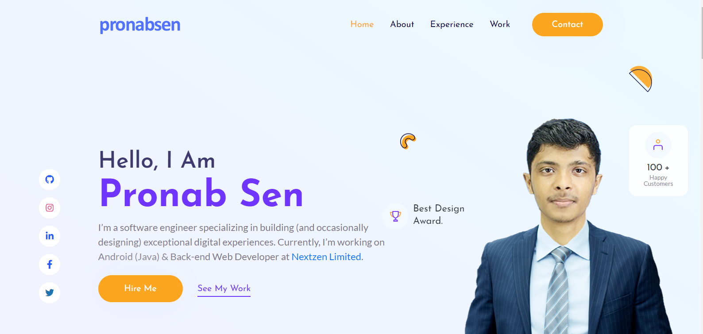
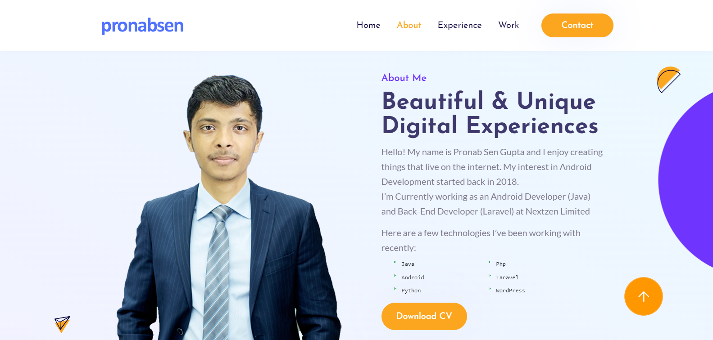
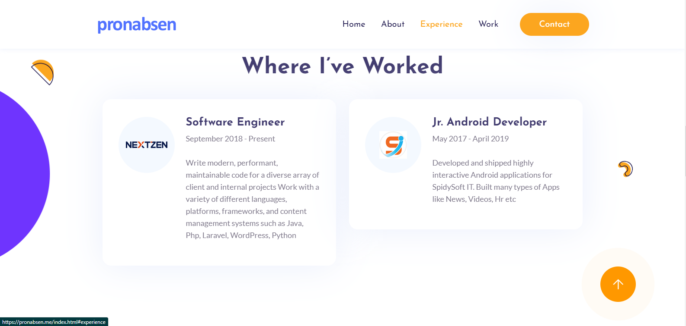
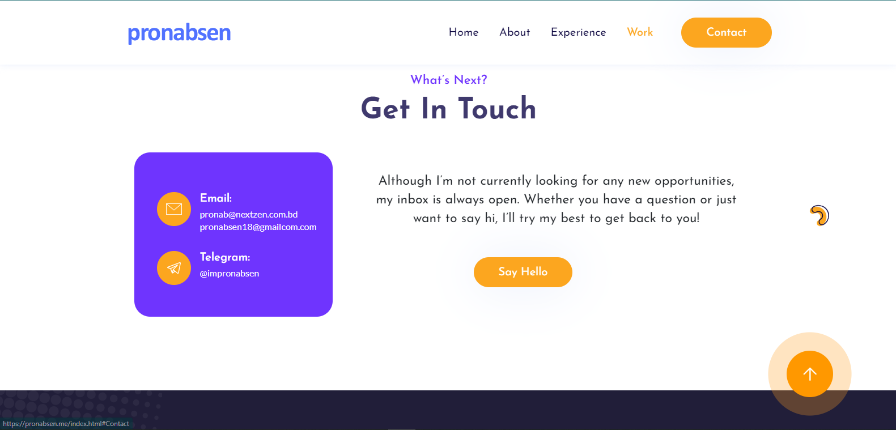
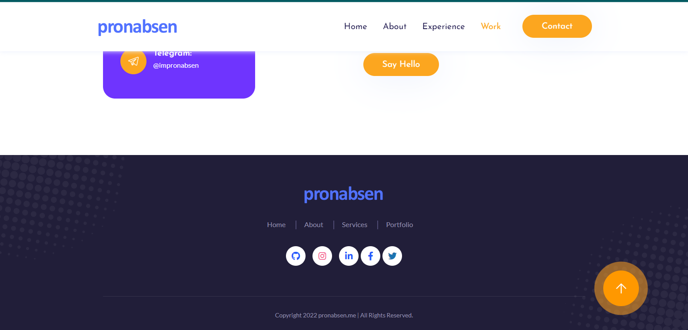

<h1 align="center">Welcome 👋</h1>

>  Portfolio Website in HTML

# # Portfolio-Website-HTML

## Screens

<pre>

</pre>
&nbsp;&nbsp;&nbsp;&nbsp;&nbsp;&nbsp;&nbsp;&nbsp;&nbsp;&nbsp;   
&nbsp;&nbsp;&nbsp;&nbsp;&nbsp;&nbsp;&nbsp;&nbsp;&nbsp;&nbsp;   
&nbsp;&nbsp;&nbsp;&nbsp;&nbsp;&nbsp;&nbsp;&nbsp;&nbsp;&nbsp;    
&nbsp;&nbsp;&nbsp;&nbsp;&nbsp;&nbsp;&nbsp;&nbsp;&nbsp;&nbsp;   
&nbsp;&nbsp;&nbsp;&nbsp;&nbsp;&nbsp;&nbsp;&nbsp;&nbsp;&nbsp;   
&nbsp;&nbsp;&nbsp;&nbsp;&nbsp;&nbsp;&nbsp;&nbsp;&nbsp;&nbsp;   

## Author

👤 **pronabsen**

* Twitter: [@impronabsen](https://twitter.com/impronabsen)
* Github: [@pronabsen](https://github.com/pronabsen)

## 🤝 Contributing

Contributions, issues and feature requests are welcome ! Feel free to check [issues page](https://www.coolflutter.com/).

## Show your support

Give a ⭐️ if this project helped you !

## 📝 License

Copyright © 2019 [pronabsen](https://github.com/pronabsen). 
This project is [MIT](https://pronabsen.me/) licensed.
